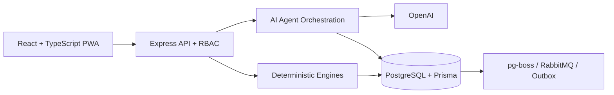

# BuildWatch дипломын төслийн танилцуулга

**Зориулалт:** диплом хамгаалалтын 9–10 минутын үндсэн танилцуулга  
**Бүтэц:** Асуудал → Шийдэл → Нотолгоо  
**Оюутан:** `[Оюутны нэр]`  
**Удирдагч багш:** `[Удирдагч багшийн нэр]`  
**Сургууль / хөтөлбөр:** `[Сургууль, хөтөлбөр]`

## Энэ файлыг ашиглах дүрэм

- `Слайд дээр` хэсгийг PowerPoint дээр байрлуулна.
- `Ярих текст` хэсгийг слайд дээр хуулж тавихгүй; илтгэгчийн тэмдэглэл болгоно.
- Нэг слайд дээр нэг гол санаа, ихдээ гурван богино мэдээлэл харуулна.
- Үндсэн танилцуулга 14 слайдтай; хавсралтын слайдуудыг зөвхөн асуулт-хариултад ашиглана.
- Demo-г амьдаар хийхгүй. 60–90 секундын бичлэг бэлтгэж, screenshot-уудыг нөөц хувилбар болгоно.

---

## 1-р слайд — Нээлт: шийдвэрийн асуудал

**Хугацаа:** 30 секунд

### Слайд дээр

> **Өдрийн мэдээлэл зураг, Excel, чат, цаасан тайланд тарсан үед маргаашийн ажлыг юунд тулгуурлан төлөвлөх вэ?**

Доод буланд жижиг хэмжээгээр:

**BuildWatch — барилгын төслийн AI-agent удирдлагын систем**

### Харагдах зүйл

- Тарсан зураг, Excel, чат, тайлангийн дөрвөн дүрс.
- Тэдгээрийн голд асуултын тэмдэг эсвэл шийдвэр хүлээж буй менежерийн дүрс.
- Нэр, сургууль, лого гол мессежээс жижиг байна.

### Ярих текст

“Барилгын төсөл дээр мэдээлэл огт байхгүйдээ биш, харин олон эх сурвалжид тарж, хоорондоо зөрдөгт гол асуудал байдаг. Инженер явцаа нэг файлаар, нярав материалаа өөр бүртгэлээр, менежер төсөв ба хуваариа дахин тулгаж байж шийдвэр гаргадаг. Миний төсөл энэ тарсан мэдээллийг нэг баталгаатай урсгалд оруулахыг зорьсон.”

### Дараагийн слайд руу шилжих өгүүлбэр

“Энэ асуудал хэнд, ямар хэлбэрээр хамгийн их нөлөөлдгийг эхлээд харъя.”

---

## 2-р слайд — Асуудал: хэн зовж байна вэ?

**Хугацаа:** 40 секунд

### Слайд дээр

**Нэг төсөл — олон тусдаа үнэн**

1. **Төслийн менежер:** бодит явц, төсөв, хуваарийг гараар тулгана.
2. **Талбайн инженер:** текст, зураг, ирц, материалыг дахин шивнэ.
3. **Удирдлага:** эрсдэлийг асуудал болсны дараа мэддэг.

### Харагдах зүйл

- Менежер, инженер, удирдлага гэсэн гурван дүрс.
- Дүр бүрийн доор нэг л богино өгүүлбэр.
- Улаан өнгөөр “гараар тулгах”, “дахин шивэх”, “оройтож мэдэх” гэсэн гурван үгийг тодруулна.

### Ярих текст

“Менежерийн хувьд аль тоо нь хамгийн сүүлийн, батлагдсан хувилбар вэ гэдэг тодорхой биш болдог. Талбайн инженер нэг мэдээллээ хэд хэдэн хэлбэрээр дахин оруулдаг. Харин удирдлага эрсдэлийн дохиог эрт биш, хоцролт бодитоор үүссэний дараа хардаг. Иймээс зөвхөн мэдээлэл хадгалдаг систем биш, эх сурвалжтайгаар нэгтгэж, шалгаж, шийдвэрийн ноорог гаргадаг систем шаардлагатай.”

---

## 3-р слайд — Одоогийн урсгал яагаад удаан вэ?

**Хугацаа:** 35 секунд

### Слайд дээр

```text
Зураг + Excel + Өдрийн тайлан + Материалын бүртгэл
                         ↓
                  Гараар тулгалт
                         ↓
            Хоцорсон шийдвэр / зөрүү
```

Том мессеж:

> **Өгөгдөл бий. Харин итгэж ашиглах нэгдсэн хувилбар алга.**

### Харагдах зүйл

- Дээрх урсгалыг таван хайрцгаас хэтрэхгүй диаграмаар үзүүлнэ.
- “Гараар тулгалт” хэсгийг улаанаар тодруулна.

### Ярих текст

“Файл бүр дангаараа буруу биш. Гол эрсдэл нь тэдгээрийг хэн, хэзээ, ямар хувилбараар баталсан нь тасардагт оршино. Тиймээс BuildWatch-ийн төв санаа нь AI-аар шууд автомат шийдвэр гаргуулах биш, өгөгдлийг эх сурвалжтай draft болгож, хүнээр батлуулаад, дараа нь системийн албан ёсны хувилбар болгох юм.”

---

## 4-р слайд — Шийдэл: BuildWatch

**Хугацаа:** 40 секунд

### Слайд дээр

> **BuildWatch нь барилгын зураг, төсөв, хуваарь, талбайн тайланг нэг баталгаатай урсгалд холбож, эрсдэл, төлөвлөгөө, тайланг эх сурвалжтай гаргадаг AI-agent систем.**

Доор нь гурван түлхүүр үг:

- **Эх сурвалжтай**
- **Хүнээр баталгааждаг**
- **Детерминистик тооцоотой**

### Харагдах зүйл

- Нэг том өгүүлбэр.
- Доор нь source, human review, calculation гэсэн гурван дүрс.
- Технологийн нэр энэ слайд дээр оруулахгүй.

### Ярих текст

“Системийн хэрэглэгчид авах гол ашиг нь нэг дэлгэц дээр зураг төслөөс quantity, estimate, schedule гаргах, талбайн мэдээллийг бүтэцлэх, эрсдэлийг эрт харах, тайлан бэлтгэх, төслийн мэдээллээс эх сурвалжтай хариулт авах боломж юм. AI нь ноорог бэлтгэнэ, харин эрх бүхий хүн баталж байж албан ёсны өгөгдөлд хэрэгжинэ.”

### 15 секундын богино тайлбар

“BuildWatch бол барилгын төслийн тарсан мэдээллийг нэгтгэж, баталгаатай төлөвлөгөө, эрсдэл, тайлан болгодог AI-agent систем.”

---

## 5-р слайд — Нэг төслийн бүтэн урсгал

**Хугацаа:** 45 секунд

### Слайд дээр

```text
Зураг / Excel
      ↓
Quantity → Estimate → WBS → Gantt → Baseline
      ↓
Өдрийн plan → Талбайн actual → Verification
      ↓
Forecast → Зөвлөмж → Тайлан → Эх сурвалжтай чат
```

Том мессеж:

> **Нооргоос батлагдсан хувилбар хүртэл нэг урсгал.**

### Харагдах зүйл

- Дээрх урсгалыг зүүнээс баруун тийш гурван мөрөөр үзүүлнэ.
- Draft хэсгийг шар, approved хэсгийг ногоон өнгөөр ялгана.

### Ярих текст

“Эхлээд зураг, BOQ, норм, үнийн мэдээллээс quantity, estimate, WBS, schedule үүснэ. Эдгээрийг хүн review хийж baseline болгоно. Baseline дээр үндэслэн өдөр тутмын plan гарч, талбайн actual, зураг, ирц, материалтай тулгагдана. Дараа нь forecast, зөвлөмж, баримт бичиг болон лавлагааны хариулт гарна. Ингэснээр төлөвлөгөө болон бодит гүйцэтгэл нэг урсгалд орж байна.”

---

## 6-р слайд — Demo: нэг хэрэглэгчийн нэг замнал

**Хугацаа:** 60–90 секунд

### Слайд дээр

**Demo — зураг төслөөс баталгаатай хуваарь хүртэл**

```text
1. Project нээх
2. Quantity / Estimate шалгах
3. Gantt ба critical path харах
4. Review queue-ээр батлах
```

### Demo бичлэгийн дараалал

| Хугацаа | Дэлгэц | Ярих зүйл |
|---:|---|---|
| 0–10 сек | Компанийн админ нэвтрэх | “Хэрэглэгч өөрийн role болон оноогдсон төслөө л харна.” |
| 10–25 сек | Төслийн A0 workspace | “Зураг, Excel, revision нь нэг project scope-д бүртгэгдсэн.” |
| 25–45 сек | Quantity → Estimate | “Тоо хэмжээ ба үнэ эх сурвалж, version-тэй харагдана.” |
| 45–65 сек | Gantt | “Сар, өдөр, critical path болон ажлын хугацаа харагдана.” |
| 65–85 сек | Review queue | “Хүн баталсны дараа л authoritative хувилбар болно.” |

### Demo-д ашиглах зураг

- `agent-console/data/full-feature-audit/a0-after-processing.png`
- `agent-console/data/gantt-desktop.png`
- Нөөц зураг: `agent-console/data/browser-smoke/desktop.png`

### Ярих текст

“Энэ бичлэгт нэг компанийн администратор төслөө нээгээд зураг, quantity, estimate, WBS, Gantt-аа шалгаж байна. Gantt дээр сар, өдөр, ажлын хугацаа болон critical зам харагдана. Эцэст нь review queue дээр эрх бүхий хүн шийдвэр гаргаж, батлагдсан хувилбар төсөлд хэрэгжинэ. Demo-г урьдчилан бичсэн учраас интернет эсвэл API доголдсон ч хамгаалалтын урсгал тасрахгүй.”

---

## 7-р слайд — AI агентууд юу хийдэг вэ?

**Хугацаа:** 50 секунд

### Слайд дээр

| Агент | Нэг өгүүлбэрээр |
|---|---|
| **A0** | Зураг, BOQ, нормоос quantity, estimate, schedule draft үүсгэнэ. |
| **A1** | Текст/зурагнаас талбайн мэдээллийг confidence, evidence-тэй бүтэцлэнэ. |
| **A2** | Эрсдэл, чиг хандлага, үндсэн шалтгаан, зөвлөмж илрүүлнэ. |
| **A3** | Тайлан, дүгнэлт, албан бичиг, PDF draft гаргана. |
| **A4** | Зөвшөөрөгдсөн төслийн мэдээллээс эх сурвалжтай хариулна. |
| **A5** | Baseline дээр үндэслэн өдрийн боломжит plan, forecast гаргана. |

### Харагдах зүйл

- Зургаан жижиг card ашиглана.
- Агент бүрд нэг дүрс, нэг мөр тайлбар байна.
- Prompt эсвэл class нэр харуулахгүй.

### Ярих текст

“Агент бүрийн ownership тусдаа. A0 зураг төсөл ба baseline, A1 бүртгэл, A2 ажиглалт, A3 баримт бичиг, A4 лавлагаа, A5 өдрийн төлөвлөлтийг хариуцна. Агентууд бие биенийхээ өгөгдлийг шууд өөрчилдөггүй. Version-тэй contract болон review task-аар холбогддог.”

---

## 8-р слайд — Архитектур: таван үндсэн блок

**Хугацаа:** 50 секунд

### Слайд дээр



Доор нь нэг өгүүлбэр:

> **AI ноорог гаргана. Хүн батална. Детерминистик хөдөлгүүр тооцоолно.**

### Ярих текст

“Frontend нь desktop болон талбайн PWA хэрэглээг хариуцна. Express API нь JWT, role, tenant, project permission-ийг шалгана. OpenAI нь текст, зураг ойлгох болон ноорог үүсгэхэд ашиглагдана. Харин quantity, estimate, CPM, forecast, rules зэрэг тооцоог deterministic TypeScript хөдөлгүүр хийдэг. Батлагдсан өгөгдөл PostgreSQL-д version, audit, outbox-той хадгалагдана.”

---

## 9-р слайд — Яагаад ийм технологи сонгосон бэ?

**Хугацаа:** 40 секунд

### Слайд дээр

1. **PostgreSQL + Prisma** — transaction, version, audit, tenant isolation.
2. **OpenAI зөвхөн draft-д** — хэл, зураг ойлгоно; тооцоог зохиохгүй.
3. **Modular monolith** — дипломын хэмжээнд test, trace, deployment-ийг хялбарчилна.

### Харагдах зүйл

- Гурван том decision card.
- PostgreSQL сонголтыг өөр өнгөөр тодруулна.

### Ярих текст

“Хамгийн чухал сонголт нь PostgreSQL байсан. Учир нь батлагдсан version өөрчлөгдөхгүй байх, audit append-only байх, review болон apply нэг transaction-д хийгдэх шаардлагатай. OpenAI-г тооцооны үнэн эх сурвалж болгоогүй. Энэ нь ижил input-д ижил үр дүн гаргах, алдааг unit test-ээр барих боломж олгосон. Микросервисийн оронд modular monolith сонгосноор хэт төвөгшилгүйгээр module ownership-ийг хадгалсан.”

---

## 10-р слайд — Итгэлцэл ба аюулгүй байдал

**Хугацаа:** 45 секунд

### Слайд дээр

**AI шууд өөрчилдөггүй**

```text
Draft → Validation → Human review → Approved command → Audit
```

- **7 role бүхий RBAC**
- **Tenant + project isolation**
- **JWT access/refresh rotation**

### Харагдах зүйл

- Draft-аас audit хүртэлх таван шат.
- “Human review” хэсгийг хамгийн тод өнгөөр тэмдэглэнэ.

### Ярих текст

“AI-ийн үр дүн шууд төсөв, хуваарь, тайланд бичигдэхгүй. Validation болон хүний review заавал дамжина. Өөрийн үүсгэсэн task-аа энгийн горимоор өөрөө approve хийхийг хориглодог. Backend бүх API дээр tenant болон project permission шалгадаг. Access token богино настай, refresh token rotation-той. Apply бүр immutable version, audit log, outbox event үүсгэдэг.”

---

## 11-р слайд — Үр дүн: код байгаа биш, ажиллаж байгааг хэмжсэн

**Хугацаа:** 60 секунд

### Слайд дээр

Гурван том тоо:

> **671 backend test + 49 frontend test**

> **A1–A5 golden evaluation: 100% PASS**

> **Forecast: дунджаар 14.52 ажлын өдрийн өмнө анхааруулсан**

Доод хэсэгт жижиг тайлбар:

`Golden dataset + simulation + local regression үр дүн; бодит талбайн user study биш.`

### Ярих текст

“Backend-ийн 127 suite, 671 тест, frontend-ийн 18 suite, 49 component тест амжилттай. A1-ийн 25 case, 138 field; A2-ийн 3 case; A3-ийн 3 case; A4-ийн 6 case; A5-ийн 11 planning scenario бүгд хамгийн сүүлийн evaluation дээр тэнцсэн. Forecast simulation-ийн 32 case-д critical-delay recall 100 хувь, false-alert 0 хувь, дундаж early warning 14.52 ажлын өдөр байсан. Эдгээр нь лабораторийн golden dataset болон simulation үр дүн гэдгийг зориуд ялгаж хэлж байна.”

### Нотолгооны файлууд

- `agents/data/evaluations/a1-live-final-v2.md`
- `agents/data/evaluations/a2-live-final.md`
- `agents/data/evaluations/a3-final.md`
- `agents/data/evaluations/a4-live-final-v2.md`
- `agents/data/evaluations/buildwatch-v22-planning-latest.md`
- `agents/data/evaluations/buildwatch-v22-operational-forecast-latest.md`

---

## 12-р слайд — Техникийн баталгаа

**Хугацаа:** 40 секунд

### Слайд дээр

| Шалгалт | Үр дүн |
|---|---:|
| PostgreSQL canonical table | **38 / 38** |
| Database invariant trigger | **18 / 18** |
| Tenant isolation smoke | **PASS** |
| Local API p95 | **16.11 ms** |

Том мессеж:

> **Өгөгдлийн бүрэн бүтэн байдал зөвхөн application code-д биш, database түвшинд хамгаалагдсан.**

### Ярих текст

“PostgreSQL smoke шалгалтаар шаардлагатай 38 table, 18 invariant trigger бүрэн байсан. Audit log-ийг update хийх оролдлогыг database trigger өөрөө хориглосон. Cross-tenant project access 404 буцааж, нөгөө tenant-ийн өгөгдөл задраагүй. Local performance regression дээр API p95 16.11 миллисекунд байсан. Гэхдээ энэ нь production cloud load test биш, локал техникийн gate юм.”

### Нотолгооны файлууд

- `agents/data/evaluations/buildwatch-v22-phase9-postgres.json`
- `agents/data/evaluations/buildwatch-v22-phase10-postgres.json`
- `agents/data/evaluations/phase11-performance.md`

---

## 13-р слайд — Хязгаарлалт ба сурсан зүйл

**Хугацаа:** 45 секунд

### Слайд дээр

1. **Бодит талбайн урт хугацааны pilot хийгдээгүй.**  
   → Reviewer-тай бодит dataset болон user study шаардлагатай.
2. **OpenAI live extraction нь quota, сүлжээнээс хамаарна.**  
   → Deterministic calculation болон батлагдсан өгөгдөл тусдаа ажиллана.
3. **DWG/IFC гүн geometry extraction бүрэн биш.**  
   → MVP нь reviewed PDF/XLSX, source болон scale verification-д төвлөрсөн.

### Ярих текст

“Энэ төслийн хамгийн том хязгаарлалт бол олон сарын бодит талбайн хэрэглэгчийн судалгаа хараахан хийгдээгүй явдал. AI extraction нь API quota болон сүлжээнээс хамаардаг учраас deterministic calculation-ийг түүнээс тусгаарласан. Мөн DWG, IFC-ийн бүх geometry-г автоматаар хэмждэг түвшин нь дараагийн scope. Миний сурсан гол зүйл бол AI-ийн accuracy-аас гадна source, permission, version, human review нь production системд илүү чухал байдаг.”

---

## 14-р слайд — Цаашдын төлөвлөгөө

**Хугацаа:** 35 секунд

### Слайд дээр

```text
0–1 сар   → 60+ бодит зураг, мэргэжлийн reviewer бүхий dataset
1–3 сар   → Нэг барилгын талбайд mobile/offline pilot
3–6 сар   → Cloud deployment, load test, pentest, observability
6–12 сар  → IFC/DWG integration ба олон байгууллагын pilot
```

### Ярих текст

“Эхний алхам нь бодит зураг, зөвшөөрөл, мэргэжлийн reviewer бүхий dataset бүрдүүлэх. Дараа нь нэг барилгын талбайд mobile offline урсгалыг туршиж, хугацаа, алдаа, data-loss-ийг хэмжинэ. Үүний дараа cloud deployment, production topology load test, independent security test хийнэ. Урт хугацаанд IFC/DWG integration болон олон байгууллагын pilot руу шилжинэ.”

---

## 15-р слайд — Хаалт

**Хугацаа:** 20 секунд

### Слайд дээр

> **BuildWatch: тарсан мэдээллээс эх сурвалжтай, хүнээр батлагдсан шийдвэр хүртэл.**

Доор нь:

- **671 + 49 автомат тест**
- **A1–A5 evaluation PASS**
- `[Оюутны нэр] · [Имэйл]`

**Асуултад бэлэн байна.**

### Ярих текст

“BuildWatch-ийн гол үр дүн нь AI нэмсэндээ биш, тарсан мэдээллийг эх сурвалжтай draft, хүний review, deterministic calculation, audit бүхий нэг урсгал болгосонд оршино. Ингэснээр барилгын төсөл шийдвэрээ илүү эрт, илүү тайлбарлагдахуйц гаргах суурь бүрдсэн. Асуултад бэлэн байна.”

---

# Асуулт-хариултын хавсралт

## Хавсралт A — Комисс асууж болох асуултууд

### “AI буруу мэдээлэл гаргавал яах вэ?”

AI-ийн output үргэлж draft. Confidence, evidence, validation харагдаж, хүн засаж эсвэл reject хийнэ. Approve болон approved command дамжсаны дараа л албан ёсны өгөгдөлд хэрэгжинэ.

### “Яагаад бүх тооцоог AI-аар хийлгээгүй вэ?”

Quantity, estimate, CPM, forecast, material balance зэрэг тооцоо давтагдах боломжтой, audit хийх боломжтой байх ёстой. Тиймээс deterministic engine ашигласан; AI нь бүтэцлэх, тайлбарлах, ноорог гаргах үүрэгтэй.

### “Яагаад PostgreSQL сонгосон бэ?”

Version, transaction, append-only audit, tenant isolation, idempotency болон review/apply atomic boundary хэрэгтэй байсан. PostgreSQL trigger болон serializable transaction-аар application code-оос гадна database түвшинд хамгаалсан.

### “Өөр tenant-ийн мэдээлэл алдагдахгүйг яаж баталсан бэ?”

API бүр JWT principal, tenant, project membership, permission шалгана. Cross-tenant smoke болон IDOR тестээр нөгөө tenant-ийн project 404 буцааж, marker задраагүйг шалгасан.

### “Бодит хэрэглэгч туршсан уу?”

Одоогийн үр дүн golden dataset, simulation, local smoke болон browser audit дээр тулгуурласан. Урт хугацааны бодит талбайн pilot хараахан хийгдээгүй бөгөөд roadmap-ийн дараагийн гол ажил.

### “OpenAI ажиллахгүй бол систем бүхэлдээ зогсох уу?”

Шинэ AI extraction болон generation түр ажиллахгүй. Харин батлагдсан өгөгдөл, deterministic analysis, quantity/estimate/schedule, review, dashboard зэрэг үндсэн боломжууд үргэлжлэн ажиллана.

### “Таны өөрийн хийсэн хамгийн чухал хэсэг юу вэ?”

Агентын prompt-оос илүүтэй canonical data model, human review, approved command, deterministic calculation, tenant-safe tool layer, evaluation болон frontend-backend бүтэн урсгалыг нэгтгэсэн хэсэг.

---

## Хавсралт B — Demo бэлтгэх checklist

- [ ] `agent-console` дотор `pnpm.cmd dev` ажиллаж байгаа.
- [ ] `http://127.0.0.1:4173` нээгдэж байгаа.
- [ ] Demo account-аар урьдчилан login хийж шалгасан.
- [ ] Demo project сонгогдсон.
- [ ] A0 quantity, estimate, Gantt, baseline харагдаж байгаа.
- [ ] A1 structured draft болон review task харагдаж байгаа.
- [ ] A4 асуултын source chip харагдаж байгаа.
- [ ] 60–90 секундын MP4 бичлэг local disk дээр хадгалагдсан.
- [ ] Video тоглохгүй үед ашиглах 3–4 screenshot слайдад суулгасан.
- [ ] OpenAI live call-ыг хамгаалалтын үеэр заавал хийхгүй; бичлэг ашиглана.
- [ ] Танилцуулгын PDF backup USB болон cloud-д хадгалагдсан.

---

## Хавсралт C — Танилцуулгын хугацааны хуваарилалт

| Хэсэг | Слайд | Хугацаа |
|---|---:|---:|
| Нээлт | 1 | 0:30 |
| Асуудал | 2–3 | 1:15 |
| Шийдэл | 4–5 | 1:25 |
| Demo | 6 | 1:20 |
| Agent, architecture, technology | 7–9 | 2:10 |
| Trust/security | 10 | 0:45 |
| Үр дүн ба нотолгоо | 11–12 | 1:40 |
| Хязгаарлалт | 13 | 0:45 |
| Roadmap | 14 | 0:35 |
| Хаалт | 15 | 0:20 |
| **Нийт** | **15** | **ойролцоогоор 10:45** |

Хэрэв хамгаалалтын хугацаа 8 минут бол 3, 9, 12-р слайдыг алгасаж, нотолгооны гол тоонуудыг 11-р слайд дээр нэгтгэнэ.

---

## Хавсралт D — Слайдын дизайн

- Background: BuildWatch-ийн одоогийн dark navy өнгө.
- Accent: mint green; warning/critical-д orange/red.
- Гарчиг: 32–40 pt.
- Гол тоо: 44–64 pt.
- Үндсэн текст: 22–28 pt-ээс багагүй.
- Нэг слайд дээр гурваас олон accent өнгө ашиглахгүй.
- Screenshot-ийг бүтнээр нь жижигрүүлэхгүй; харуулах хэсгийг crop хийж томруулна.
- Слайд бүрийг 3 секунд харахад гол санаа ойлгогдох ёстой.
- “Баярлалаа” гэсэн дан слайд хийхгүй; хаалтын мессежийг асуулт-хариултын турш дэлгэц дээр үлдээнэ.

